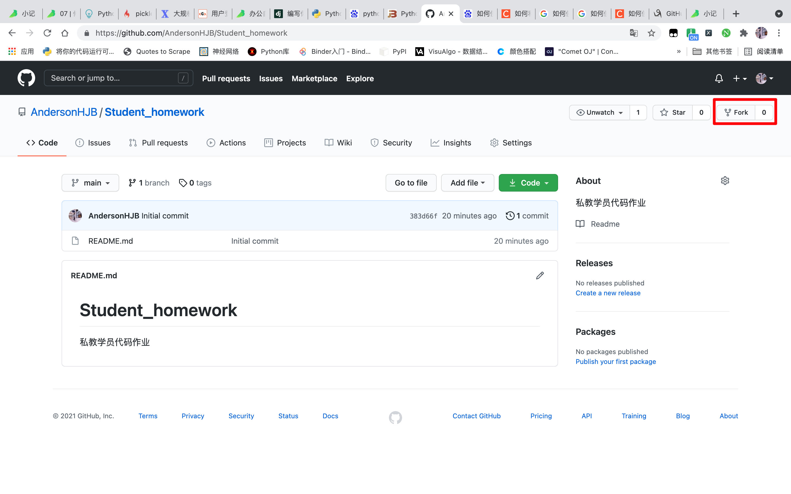

# Student_homework
私教学员代码作业

# 1. 首先 Fork 他人的 repository（代码仓库）

Fork 的名词是  **叉子**  的意思，不过这里取的是动词 **分叉，建一个分支** 的意思。进入你想参与合作开发的仓库界面，点击右上角的 **Fork** 图标，此时你已经复制了一个副本在你的 GitHub 仓库中了，或者是说一个新的代码仓库被创建了，可以打开你的 GitHub 主页看一看。

**注意，这个远程仓库是属于你自己的。这里 Fork 不同于 Clone，Clone 是发生在你的本地机器中，相当于你复制了一个完全相同的副本在你的终端上，但该副本的远程仓库连接的仍然是原作者的仓库，所以你并不是这个项目仓库的拥有者，没有更新它的权限。**

因此，Fork 正是我们所需要的。

点击之后可以看到，自己帐号内有一个新的代码仓库被创建了。

