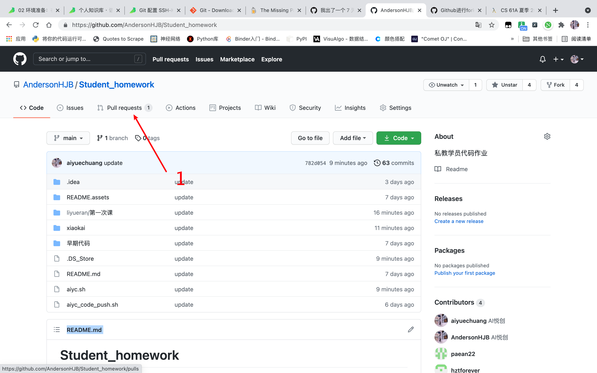
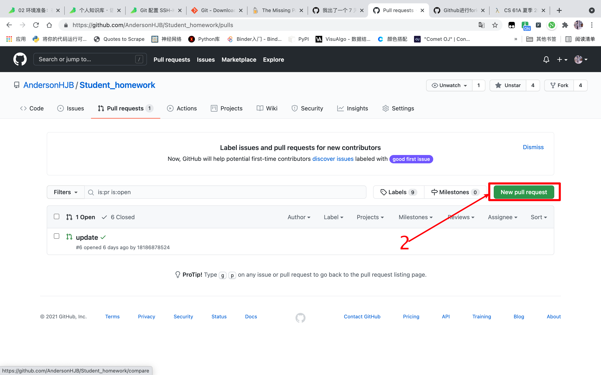

# 2021年06月11日「Python 环境搭建」

## 1. 截图软件「Snipaste」

快捷键：

- 截图：option + 1
- 贴图：option + ·


## 2. Pycharm

pass


## 3. iPad 与 MacBook Air 随航

1. 更新系统


## 4. 交作业

1. 创建自己的文件夹
2. 放到对应每次课文件夹里面「没有则创建」
3. 使用命令：

```shell
sh aiyc_code_push.sh
```

4. 





5. 跟我说提交了


## 5. 同步课上代码｜资料

```shell
sh aiyc_code_push.sh
```


## 6. 课程回放

[https://www.aiyc.top/courses/liyueran](https://www.aiyc.top/courses/liyueran)


## 7. 51CTO 课程加入

[https://edu.51cto.com/lecturer/13952552.html](https://edu.51cto.com/lecturer/13952552.html)


## 8. 看文章

为什么我们要学习编程？：https://www.aiyc.top/731.html

