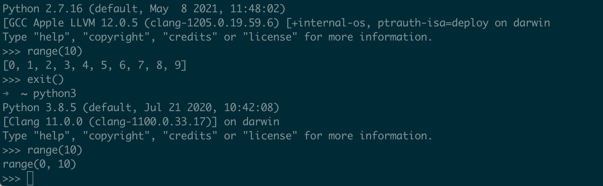

# whlie and for

```python
# -*- coding: utf-8 -*-
# @Time    : 2021/6/22 10:13 下午
# @Author  : AI悦创
# @FileName: demo01.py
# @Software: PyCharm
# @Blog    ：http://www.aiyc.top
# @公众号   ：AI悦创
user_answer_correct = False

while not user_answer_correct:
	user_gender = input("Please your input sex:(F/M)>>>")
	if user_gender == "F":
		print("你是萌妹子学生。")
		user_answer_correct = True
		"""
		1. 程序运行到这里，那是不是表面程序正常（确）运行，
			显然有可能会有个误导性，所以一开始：user_answer_correct 为 False，正确运行后：赋值为 True
		2. while True:pass?
			如果直接 while True:pass >>> 后面 True 如何变为 False
		"""
	elif user_gender == "M":
		print("你是糙汉子。")
	else:
		print("输入不正确，请输入 F 或 M！")
	
# while True:
# 	user_gender = input("Please your input sex:(F/M)>>>")
# 	if user_gender == "F":
# 		print("你是萌妹子学生。")

```



