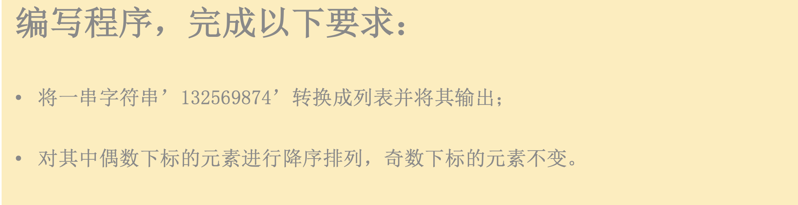

# HW and list and tuple

## 1. HW

- 代码文件/变量：见名知意

```python
name_input = input("Please input input name:>>>")
# username/user_name/username_input
```

- Input 得到的数据类型是？>>> string
- `In [7]: print("\t\t\tResume")`
- 代码格式化：option + command + L
- **只要你需求实现了，是没有对错，只有需求以及优化。**


## 2. list

```python
str1 = "ai      yc"
print(list(str1))

# ['a', 'i', ' ', ' ', ' ', ' ', ' ', ' ', 'y', 'c']
```

- Markdown：[https://www.runoob.com/markdown/md-tutorial.html](https://www.runoob.com/markdown/md-tutorial.html)

- Markdown高级用法(嵌套音视频)：[https://www.aiyc.top/93.html](https://www.aiyc.top/93.html)

<video id="video" controls="" preload="none" poster="http://img.blog.fandong.me/2017-08-26-Markdown-Advance-Video.jpg">
      <source id="mp4" src="http://img.blog.fandong.me/2017-08-26-Markdown-Advance-Video.mp4" type="video/mp4">
      </video>

- **计算任意列表的开头与结尾 + - * /**

```python
lst = [1, 2, 3, 4, 5, 6, 7, 8]
print(lst[0] + lst[-1])
```

```python
In [1]: name = list('Python')

In [2]: name
Out[2]: ['P', 'y', 't', 'h', 'o', 'n']

In [3]: name[2:]
Out[3]: ['t', 'h', 'o', 'n']

In [4]: list('abc')
Out[4]: ['a', 'b', 'c']

In [5]: name[2:] = list("abc")

In [6]: name
Out[6]: ['P', 'y', 'a', 'b', 'c']
```



```python
In [33]: lst = [3, 1, 2, 5, 6, 7, 9]

In [34]: lst.sort()

In [35]: lst
Out[35]: [1, 2, 3, 5, 6, 7, 9]

In [36]: lst.sort(reverse=True)

In [37]: lst
Out[37]: [9, 7, 6, 5, 3, 2, 1]
```

